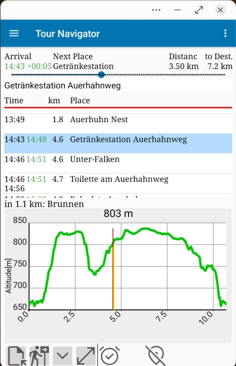

  

# Tour-Navigator
Timetable of a hiking tour

Tour Navigator is a Privacy Friendly App for Android which presents hikers a timetable of a planned GPX route containing wayponts.

It's development is based on
- Privacy Friendly Apps developed by the Technical University of Darmstadt: a group of Android applications which are optimized regarding privacy. Further information can be found on https://secuso.org/pfa

- GpsPrune is a map-based application for viewing, editing and converting coordinate data from GPS systems. Further information and Java runnables can be found on  https://gpsprune.activityworkshop.net .

## Motivation

This application has been developed to be used for hiking. 

## Download and more Information

You can freely download the Android app from [GitHub](https://github.com/biselliw/HikingNavigatorApp/app/build/outputs/apk/debug/HikingNavigatorApp-debug-v1.0.apk)

Further development requires Android Studio, we recommend to use at least version 3.1.1
 
### API Reference

Mininum SDK: 23
Target SDK: 34 

## License

This program is free software: you can redistribute it and/or modify
it under the terms of the GNU General Public License as published by
the Free Software Foundation, either version 2 of the License, or
(at your option) any later version.

This program is distributed in the hope that it will be useful,
but WITHOUT ANY WARRANTY; without even the implied warranty of
MERCHANTABILITY or FITNESS FOR A PARTICULAR PURPOSE.  See the
GNU General Public License for more details.

You should have received a copy of the GNU General Public License
along with this program. If not, see <http://www.gnu.org/licenses/>.

Copyright (C) 2026 Walter Biselli

The program uses:

- sources from [activityworkshop.net](https://activityworkshop.net/software/gpsprune) licensed under [GNU General Public License v2.0](http://www.gnu.org/licenses)
- sources from [SECUSO Privacy friendly app example](https://github.com/SecUSo/privacy-friendly-app-example) licensed under [GNU General Public License v2.0](http://www.gnu.org/licenses)
- sources from [Nick Fellows (halfhp)](https://github.com/halfhp/androidplot) licensed under [Apache License Version 2.0](http://www.apache.org/licenses/LICENSE-2.0)
- sources from [coltoscosmin](https://github.com/coltoscosmin/FileUtils/blob/master/FileUtils.java) licensed under [Apache License Version 2.0](http://www.apache.org/licenses/LICENSE-2.0)
- icons from [Google Material Design Icons](https://fonts.google.com/icons) licensed under [Apache License Version 2.0](http://www.apache.org/licenses/LICENSE-2.0)
- web services from [GeoNames geographical database](https://www.geonames.org/) to access Wikipedia articles; licensed under a [Creative Commons Attribution 4.0 License[(https://creativecommons.org/licenses/by/4.0/)
- web services from [Overpass API](https://overpass-api.de/) to access Open Street Map (OSM) data; licensed under [Open Database License, "ODbL" 1.0[(https://osmfoundation.org/wiki/Licence)

