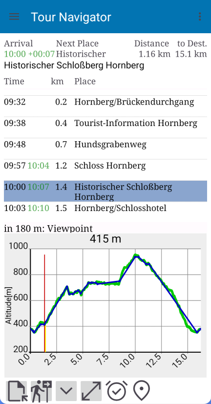

## Requirements for Using the Tour Navigator App

The Tour Navigator app requires a GPX file containing the geographic coordinates and elevation data of the planned route,

ideally also waypoints for intermediate stops.

GPX files are the standard for tours and geographical data.

You can easily obtain GPX files from tour portals, such as:

- Outdooractive (www.outdooractive.com)

- Black Forest Association (www.schwarzwaldverein-tourenportal.de)

The better prepared the file, the better Tour Navigator will work.

**Tip:** It's particularly easy with the [Black Forest Association's tour planner](https://www.schwarzwaldverein.de/schwarzwald/wandern-outdoor/tourenportal).

The Black Forest Association's tour portal already contains hundreds of suggested tours that can be directly
used.

The track already includes waypoints and an elevation profile.

Important: Check the box to ensure the waypoints are included in the GPX file. This only works in a web browser – not in Android or iOS apps.

## What does the Tour Navigator app do?

After loading the GPX file into the "Tour Navigator" app, it displays all the tour information –

if it originates from Outdooractive, it also includes a link to the Black Forest Association's tour portal.

The hiking time is calculated using individually adjustable parameters.

<h3>Details of the hiking time calculation</h3>

Tour Navigator uses the proven **DIN 33466** standard – the official basis for reliable hiking time calculation.

The formula takes speed, incline, and decline into account and provides a realistic time model.

It assumes that an average hiker:

- covers 4 km of flat terrain per hour
- ascends 300 meters per hour
- descends 500 meters per hour

For mixed sections of the route, horizontal and vertical times are calculated separately.

Hiking time is calculated as: **longer section + half the shorter section**.

**Example:**

1 km flat (15 min) + 300 m ascent (60 min)

→ 60 min + 7.5 min = **67.5 min total time**

Further information on [calculating hiking time on Wikipedia](https://de.wikipedia.org/wiki/Marschzeitberechnung).

If the track contains too few waypoints, these can be added from the free OpenStreetMap database.

Georeferenced Wikipedia articles can also be linked and displayed via the Wikipedia app.

Enter the start time for individual tour planning.

A break time with a comment can be entered for each waypoint.

From all the data, the app generates a travel time table, which can be exported as an HTML file with additional details for further editing.

If you are traveling to the starting point by car, you can use Google Maps for navigation – after granting permission.

The app accompanies you in real time during the tour.

The geo-coordinates of each waypoint can be transmitted to suitable apps, for example, to display them on a map on Locus Maps along with the track.

For points of interest (POIs), the GPX file already contains additional information, which can also be read aloud. Links lead to external content.

With the right schedule, the tour will be enjoyable for everyone!

[Back](README.md)