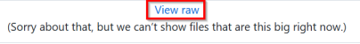

## Download

Die App Tour Navigator ist nicht im Google PlayStore verfügbar, kann aber hier in GitHub heruntergeladen werden.

Dabei ist folgender Ablauf zu beachten:

- beim Klick auf die Datei **TourNavigator.apk** erscheint zunächst die Fehlermeldung 
- um die App herunterzuladen, musst du auf ["View raw"](../../app/release/TourNavigator.apk) klicken und den Zielordner für die ausführbare Datei wählen 
- gehe zurück zu dieser Seite
- beim Klick auf die Datei **TourNavigator.apk** wird das Android-Betriebssystem zunächst die Installation blockieren,
  z.B. mit dieser Meldung „Aus Sicherheitsgründen darf dein Smartphone keine Apps aus dieser Quelle installieren.“
- tippe dazu auf „Einstellungen“
- aktiviere „Von dieser Quelle erlauben“ (z. B. „Chrome darf Apps installieren“)
📌 Wichtig: Die Erlaubnis gilt nur für diese eine App (Browser, Datei-Manager etc.), nicht global für das ganze System
- gehe zurück zur APK
- tippe „Installieren“ 
- warte bis die App installiert ist (evtl. wird sie zvor von Google Play Protect auf schädliche Inhalte geprüft, die sie aber nicht finden wird da es keine gibt)
- tippe auf „Öffnen“ um die App zu starten

[Zurück](README.md)