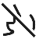

<h1>Bedienungsanleitung</h1>

Die Bedienung der App erfolgt über diese Menüs:

<h2>Hauptmenü</h2>

| Symbol                                           | Funktion |
|--------------------------------------------------|----------|
|  | Öffnet eine GPX-Datei |
|                          | Zeigt Titel, Beschreibung und Web-Link der Tour |
|                           | Kehrt die Richtung der Tour um |
|                             | Wegpunkte aus GPX oder OpenStreetMap hinzufügen |
|                             | Startzeit festlegen |
|                           | Wegzeittabelle anzeigen |
|                            | Erweiterte GPX-Datei exportieren |
|                                 | Wegzeittabelle als HTML exportieren |
|                             | Einstellungen |
|                                 | Hilfe anzeigen |
|                                 | Copyright-Informationen |

[Zurück](OPERATION.md)

<h2>Kontextmenü</h2>

Abhängig vom ausgewählten Punkt der Tour stehen diese Funktionen zur Verfügung:

| Funktion                         | Beschreibung                             |
|----------------------------------|------------------------------------------|
| Pausenzeit                       | Individuelle Pausenzeit je Wegpunkt      |
| Wegpunkt kommentieren            | Kommentar in Wegzeittabelle              |
| Wikipedia-Artikel                | Artikel im Umkreis von 10 km hinzufügen  |
| OSM-POIs                         | OpenStreetMap-POIs im Umkreis von 500 m hinzufügen |
| Zum Wegpunkt navigieren          | Übergabe an externe Karten-Apps          |
| Google-Navigation                | Navigation mit Google Maps               |
| Nicht rückgängig zu machen:      |
| **Starte von hier**              |                                          |
| **Wegpunkt entfernen**           |                                          |
| **Alle Punkte danach entfernen** |                                          |

[Zurück](OPERATION.md)

<h2>Bedien- und Statuselemente in der Fußzeile</h2>

Die Fußzeile stellt die wichtigsten Schaltflächen und Statusinformationen bereit:

<h3>Bedienelemente</h3>

| Symbol | Funktion |
|------|----------|
|  | Tracking starten/fortsetzen |
|  | Tracking pausieren |
|  | Mehr Informationen |
|  | Weniger Informationen |
|  | Sprachausgabe |
|  | Sprachausgabe stoppen |
|  | Höhenprofil anzeigen |
|  | Höhenprofil ausblenden |

[Zurück](OPERATION.md)

<h3>Statussymbole</h3>

| Symbol | Bedeutung |
|------|-----------|
|  | Alarm aktiv |
|  | Alarm deaktiviert |
|  | Standortberechtigung fehlt |
|  | Standortdienste deaktiviert |
|  | GPS aktiv – kein Fix |
|  | Ungenaue Positionsdaten |
|  | GPS-Fix vorhanden |

[Zurück](OPERATION.md)

[Zurück](README.md)