## Was macht die App Tour Navigator?

Die privatsphäre-freundliche App **Tour Navigator** hilft dir dabei, jede Wanderung vorab perfekt zu planen und unterwegs entspannt zu genießen.  
Die App erstellt aus einer vorhandenen GPX-Datei einen übersichtlichen Zeitplan – mit realistischen Gehzeiten, Zwischenzeiten und einem klar strukturierten Ablauf, genau so wie es sich ein Tourenguide für einen optimalen Wandertag wünscht.

GPX-Dateien sind der Standard für Touren und geografische Daten. Sie enthalten den genauen Verlauf einer Route, inklusive Höhenangaben und – idealerweise – benannten Wegpunkten.

Du kannst GPX-Dateien bequem über Tourenportale erhalten, z. B.:

- Outdooractive (www.outdooractive.com)
- Schwarzwaldverein (www.schwarzwaldverein-tourenportal.de)

Je besser die Datei vorbereitet ist, desto besser arbeitet Tour Navigator.

**Tipp:** Besonders einfach gelingt es mit dem [Tourenplaner des Schwarzwaldvereins](https://www.schwarzwaldverein.de/schwarzwald/wandern-outdoor/tourenportal).

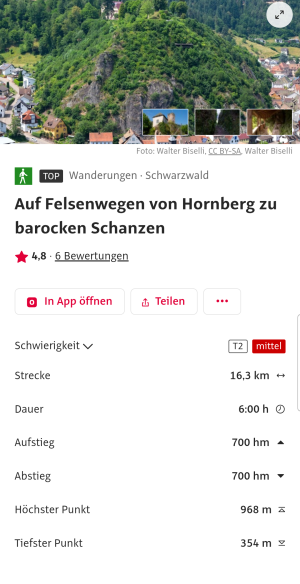
Im Tourenportal des Schwarzwaldvereins befinden sich bereits hunderte von Tourenvorschlägen, die direkt 
übernommen werden können

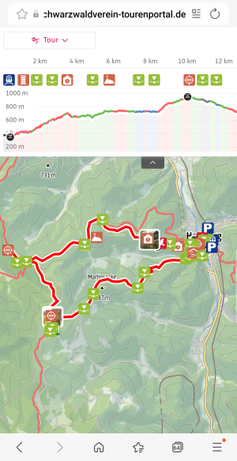
Der Track enthält bereits Wegpunkte und ein Höhenprofil

Wichtig: das Häkchen setzen, damit die Wegpunkte in die GPX-Datei übernommen werden. Das funktioniert 
nur in der Web-App - nicht in Android oder IOS Apps

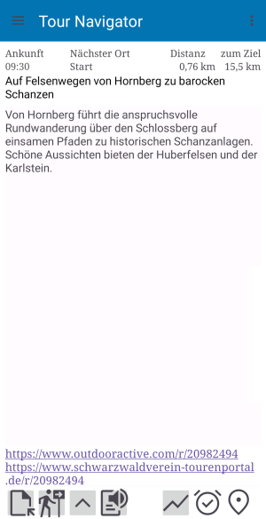
Nach dem Laden der GPX-Datei in die App "Tour Navigator" zeigt diese alle Informationen der Tour -
wenn diese von Outdooractive stammt auch mit dem Link zum Tourenportal des Schwarzwaldvereins

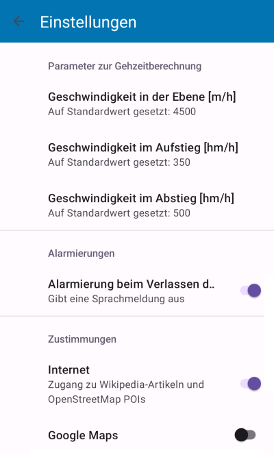
Die Berechnung der Gehzeit erfolgt über individuell einstellbare Parameter

<h3>Details der Gehzeitberechnung</h3>

Tour Navigator arbeitet mit der bewährten **DIN 33466** – der offiziellen Grundlage für verlässliche Wanderzeitberechnung.  
Die Formel berücksichtigt Geschwindigkeit, Steigung und Gefälle und liefert ein realistisches Zeitmodell.

Sie geht davon aus, dass ein durchschnittlicher Wanderer:

- 4 km ebene Strecke pro Stunde zurücklegt
- 300 Höhenmeter Aufstieg pro Stunde bewältigt
- 500 Höhenmeter Abstieg pro Stunde bewältigt

Bei gemischten Teilstrecken werden horizontale und vertikale Zeiten separat berechnet.  
Als Gehzeit gilt: **längerer Zeitanteil + Hälfte des kürzeren Anteils**.

**Beispiel:**  
1 km eben (15 min) + 300 Hm Aufstieg (60 min)  
→ 60 min + 7,5 min = **67,5 min Gesamtzeit**

Weitere Infos zur [Marschzeitberechnung auf Wikipedia](https://de.wikipedia.org/wiki/Marschzeitberechnung).

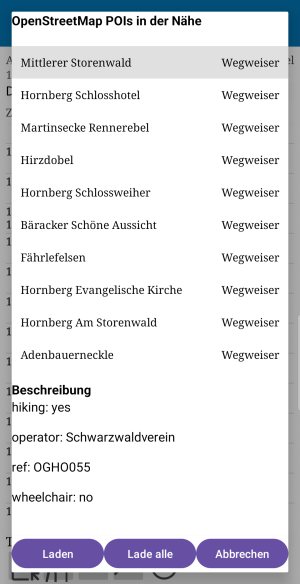
Wenn der Track zu wenig Wegpunkte enthält, können diese aus der freien OpenStreetMap-Datenbank hinzugefügt werden

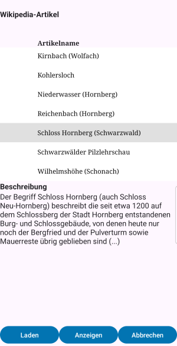
Auch georeferenzierte Wikipedia-Artikel lassen sich so verlinken und über die Wikipedia-App anzeigen

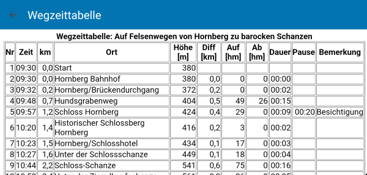
Für die individuelle Zeitplanung der Tour wird der Startzeitpunkt eingegeben. 
Zu jedem Wegpunkt kann eine Pausenzeit mit Bemerkung eingegeben werden. 

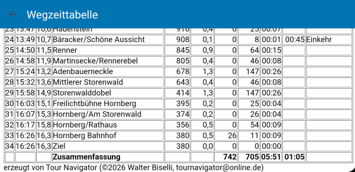
Aus allen Daten ermittelt die App eine Wegzeittabelle, die mit ergänzenden Details als HTML-Datei zur weiteren Bearbeitung exportiert werden kann

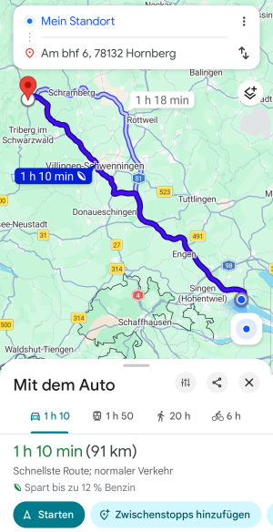
Wer mit dem Auto zum Startpunkt anreist, kann - nach eigener Freigabe - Google Maps zur Navigation nutzen

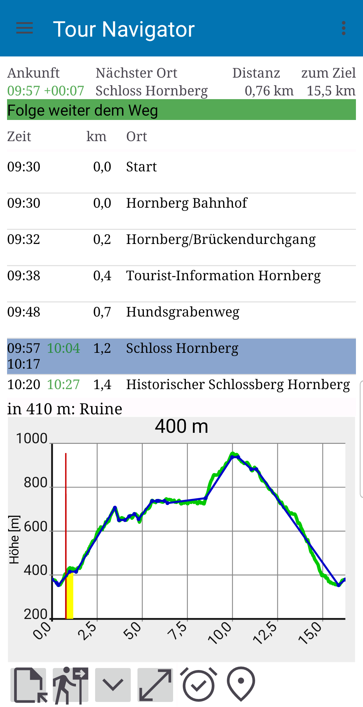
Während der Tour begleitet dich die App in Echtzeit

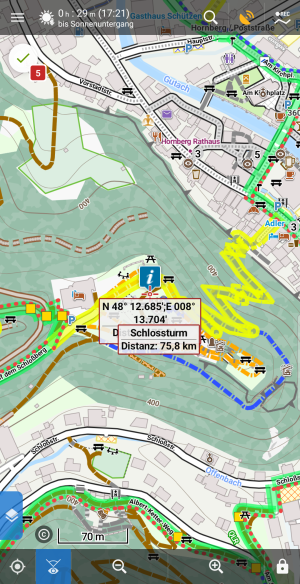
Die Geo-Koordinaten jedes einzelnen Wegpunktes lassen sich an geeignete Apps übermitteln, um sie z.B. auf LocusMaps zusammen mit dem Track auf einer Karte anzuzeigen 

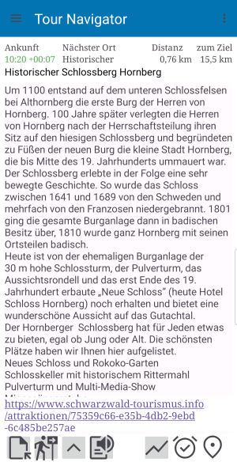
Für interessante Wegpunkte (POIs) enthält die GPX-Datei bereits zusätzliche Informationen, die sich auch vorlesen lassen. Links führen zu externen Inhalten.

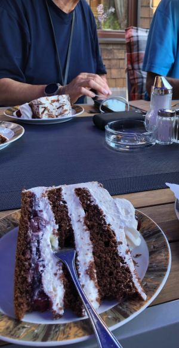
Mit dem richtigen Zeitplan wird die Tour für alle zu einem Genuss!